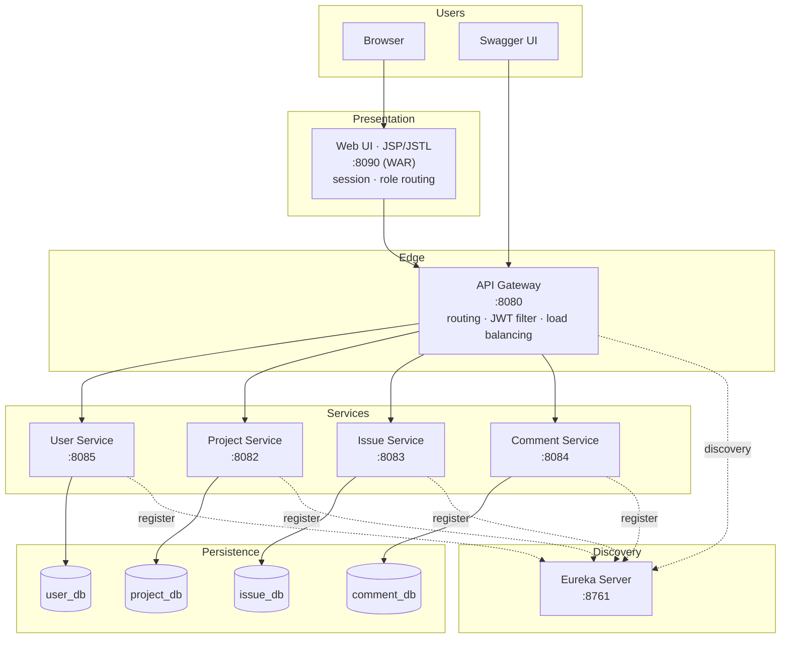
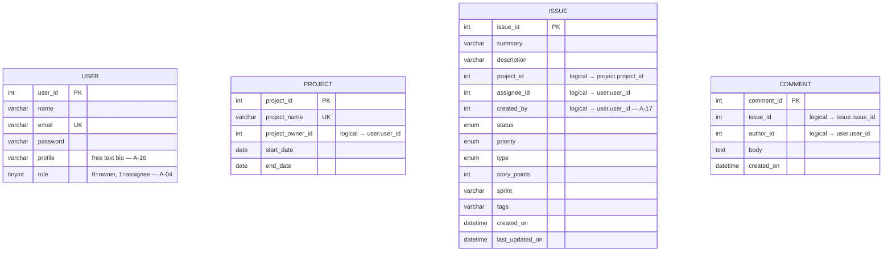
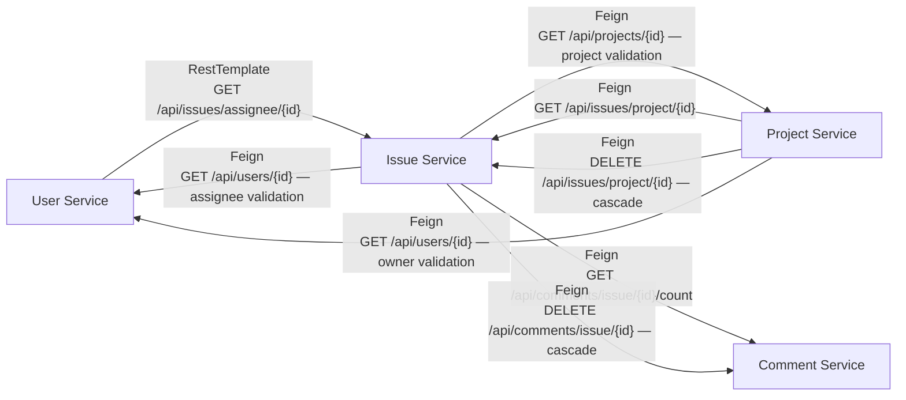
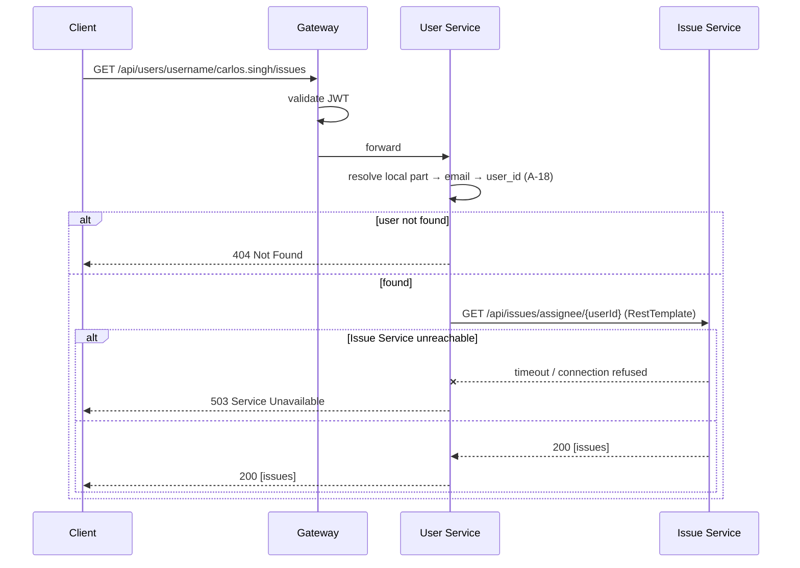
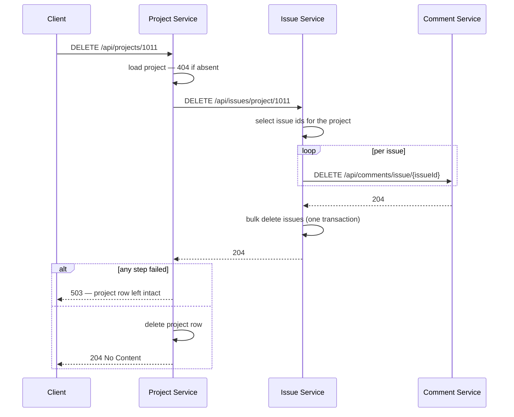
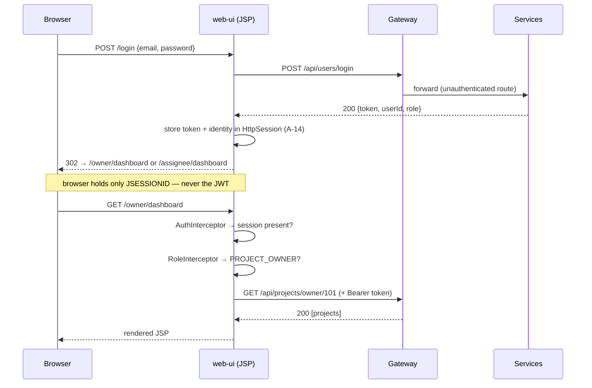

# Design Document
## Issue Tracking System (ITS) — Spring Boot, Microservices, MySQL

| Field | Value |
|---|---|
| Document | High-Level and Low-Level Design |
| Product | Issue Tracking System (ITS) |
| Status | Revision 3 — JSP web tier, cascade delete, workbook schema |
| Companion | [SRS.md](./SRS.md) — requirement IDs (`FR-*`, `NFR-*`) and assumptions (`A-*`) referenced here are defined there |

---

## 1. Design Goals

| Goal | Driven by | How the design meets it |
|---|---|---|
| Independent deployability | C-01 | Five separate Spring Boot applications, one Maven module each |
| Loose coupling | C-02 | Database-per-service; no shared tables; integration only over HTTP |
| Single API entry point | FR-SYS-02 | Spring Cloud Gateway owns all published routes; the web tier is just another client |
| Location transparency | FR-SYS-03 | Eureka registry; `lb://` URIs resolved client-side |
| Uniform failure behaviour | FR-SYS-05, NFR-08 | One error model across the services; styled error pages in the web tier |
| A UI that cannot drift from the API | C-07 | The web tier owns no rules and no database — every decision is the backend's |
| Room to grow | NFR-05 | Comment Service already carved out; event publication is an additive change |

---

## 2. System Architecture

### 2.1 Component View



### 2.2 Runtime Topology

| Component | Port | Packaging | Registry name | Depends on |
|---|---|---|---|---|
| Eureka Server | 8761 | jar | — | — |
| API Gateway | 8080 | jar | `api-gateway` | Eureka |
| User Service | 8085 | jar | `user-service` | Eureka, `user_db`, Issue Service (ISC) |
| Project Service | 8082 | jar | `project-service` | Eureka, `project_db`, Issue + User Service (ISC) |
| Issue Service | 8083 | jar | `issue-service` | Eureka, `issue_db`, User + Project + Comment Service (ISC) |
| Comment Service | 8084 | jar | `comment-service` | Eureka, `comment_db` |
| Web UI | 8090 | **war** | not registered | Gateway only |

**Start-up order:** Eureka → the four services → Gateway → Web UI. Services retry registration, so strict ordering is a convenience rather than a requirement — except for the Web UI, which is useless before the Gateway is up.

The Web UI is packaged as a **WAR, not a JAR**. This is not a style choice: Spring Boot cannot serve JSPs from an executable JAR, because Tomcat resolves JSP resources through a hard-coded file pattern that does not survive nested-jar packaging. An executable WAR (`java -jar web-ui.war`) works and is what the run scripts use. It is also the one module that is *not* registered with Eureka — it is a client of the system, not a part of it.

### 2.3 Service Responsibilities

| Component | Owns | Never does |
|---|---|---|
| User | Identity, credentials, roles, profile text; issues token | Store project or issue data |
| Project | Project lifecycle and ownership; orchestrates the delete cascade | Store issues; validate users locally |
| Issue | Issue lifecycle, assignment, status, workflow rules | Store projects, users or comment bodies |
| Comment | Comment threads on issues | Know anything about projects |
| Web UI | Sessions, navigation, rendering, form binding | Business rules, authorisation decisions, database access |

---

## 3. Module Structure

A parent Maven POM aggregates seven modules, pinning Spring Boot and Spring Cloud versions in one place.

```
issue-tracker/                    # parent pom (packaging: pom)
├── docs/
│   ├── SRS.md
│   └── DESIGN.md
├── eureka-server/
├── api-gateway/
├── user-service/
├── project-service/
├── issue-service/
├── comment-service/
└── web-ui/                       # packaging: war
```

There is deliberately **no shared `common` module carrying entities**. Shared entity classes are the classic way a "microservices" project quietly becomes a distributed monolith — a schema change in one service would force a lockstep rebuild of the others. The small amount of duplication in error-response classes is the price of independence.

### 3.1 Package Layout — API services (identical in all four)

```
com.its.<service>
├── <Service>Application.java        # @SpringBootApplication @EnableDiscoveryClient
├── config/                          # SecurityConfig, OpenApiConfig, RestTemplateConfig
├── controller/                      # @RestController — HTTP only, no business logic
├── service/                         # interface + Impl — business rules, transactions
├── repository/                      # Spring Data JPA interfaces
├── entity/                          # @Entity — persistence model, never returned to clients
├── dto/
│   ├── request/                     # inbound payloads, bean-validation annotated
│   └── response/                    # outbound payloads
├── client/                          # Feign clients / RestTemplate wrappers for ISC
├── exception/                       # custom exceptions + GlobalExceptionHandler
└── mapper/                          # entity ⇄ DTO conversion
```

**Layer rules.** Controllers speak DTOs and `ResponseEntity` only; they never touch repositories. Services hold the business rules and own transaction boundaries. Entities never cross the controller boundary — this is what keeps the password hash out of every user response (FR-USR-03).

### 3.2 Package Layout — `web-ui`

```
com.its.web
├── WebUiApplication.java            # extends SpringBootServletInitializer (WAR)
├── config/                          # WebMvcConfig (interceptors), RestClientConfig
├── controller/                      # @Controller — returns view names, not JSON
│   ├── AuthController.java          # /signup, /login, /logout
│   ├── OwnerController.java         # /owner/**
│   ├── AssigneeController.java      # /assignee/**
│   └── IssueController.java         # /issues/**  (shared by both roles)
├── client/                          # gateway-facing clients, one per backend service
├── form/                            # form-backing beans, bean-validation annotated
├── view/                            # view models assembled for JSP (never raw DTOs)
├── session/                         # SessionUser, session accessor
├── interceptor/                     # AuthInterceptor, RoleInterceptor, TokenRelayInterceptor
└── advice/                          # @ControllerAdvice → error views

src/main/webapp/WEB-INF/jsp/         # JSP views — under WEB-INF so they cannot be hit directly
src/main/resources/static/           # css, js
```

Views live under `WEB-INF` on purpose: anything under `webapp/` proper is servable by URL, and a JSP reached directly bypasses the controller that was supposed to authorise it and populate its model.

---

## 4. Data Design

### 4.1 Schema per Service

Column names follow the reference workbook ([A-15](./SRS.md#a-15)).



The relationships drawn above are **logical, not physical**. `issue.project_id`, `issue.assignee_id`, `issue.created_by`, `project.project_owner_id` and `comment.issue_id` are plain `INT` columns in different databases. Referential integrity is enforced in application code at write time (FR-PRJ-02, FR-ISS-02), never by the database engine (C-02, [A-02](./SRS.md#a-02)).

### 4.2 Indexes

| Table | Index | Serves |
|---|---|---|
| `user` | `UNIQUE (email)` | FR-USR-02, login lookup, username resolution ([A-18](./SRS.md#a-18)) |
| `project` | `INDEX (project_owner_id)` | FR-PRJ-06 |
| `project` | `UNIQUE (project_name)` | FR-PRJ-14 — a name must resolve to one project |
| `issue` | `INDEX (project_id)` | FR-ISS-10, and the cascade delete |
| `issue` | `INDEX (assignee_id)` | FR-ISS-12 |
| `issue` | `INDEX (created_by)` | FR-ISS-11 |
| `comment` | `INDEX (issue_id, created_on DESC)` | FR-CMT-02, and the cascade delete |

Each issue index exists because an ISC endpoint queries on that column — without them, every project dashboard becomes a full table scan.

### 4.3 Enums and the Role Mapping

Enums are stored with `@Enumerated(EnumType.STRING)`, never `ORDINAL`. Ordinal storage silently corrupts every existing row the moment someone inserts a new constant in the middle of the enum — a live hazard here, since only `TO_DO`, `HIGH` and `BUG` are attested by the workbook and the remaining members may yet change ([A-11](./SRS.md#a-11)).

`role` is the opposite case: it is genuinely a `TINYINT` in the schema, and the workbook fixes `0` = Project Owner, `1` = Assignee ([A-04](./SRS.md#a-04)). It is converted at exactly one place — a JPA `AttributeConverter` on the `User` entity — so the API, the JWT claim and every authorisation check work with the enum `PROJECT_OWNER` / `ASSIGNEE` and never with the digit. This matters more than it looks: this document had the encoding backwards for two revisions, and a permission check written against a raw integer would have inverted the entire model while still passing a smoke test.

### 4.4 Timestamps
`created_on` is set by `@CreationTimestamp`, `last_updated_on` by `@UpdateTimestamp`. Client-supplied values for either are discarded in the mapper (FR-ISS-03).

### 4.5 Seed Data
Each service ships a `DataSeeder` (`CommandLineRunner`, enabled by `its.seed.enabled`) loading its slice of the workbook's sample rows into an empty table (SRS §10.5), with `AUTO_INCREMENT` advanced past the seeded ids — 105 for users, 1014 for projects — so generated ids continue the workbook's sequence rather than colliding with it.

A runner rather than a `data.sql`, for one reason: the workbook lists passwords in plaintext and they must be stored as BCrypt hashes, so the seed has to run through the encoder. Committing pre-computed hashes to a SQL file would work but would hide which password each one corresponds to — which matters the moment someone needs to log in as Emily to look at the owner dashboard.

The Swagger examples and the manual acceptance pass are written against these fixtures. The sample `created_by = sam.lee` is mapped to a real user id by the loader ([A-17](./SRS.md#a-17)).

---

## 5. API Design

### 5.1 Representative Payloads

**`POST /api/users`** → `201 Created`
```jsonc
// request
{ "name": "Carlos Singh", "email": "carlos.singh@example.com", "password": "CarlosStrong$2025",
  "profile": "Front-end developer focused on accessibility", "role": "ASSIGNEE" }

// response — no password field, and role is the string form, never the digit
{ "userId": 104, "name": "Carlos Singh", "email": "carlos.singh@example.com",
  "profile": "Front-end developer focused on accessibility", "role": "ASSIGNEE",
  "message": "Your account is created successfully" }
```

**`POST /api/users/login`** → `200 OK`
```jsonc
{ "email": "emily.sinha@example.com", "password": "EmilySecure!2025" }
→
{ "token": "eyJhbGciOiJIUzI1NiJ9...", "userId": 101, "role": "PROJECT_OWNER", "expiresIn": 3600 }
```

**`POST /api/issues`** → `201 Created`
```jsonc
{ "summary": "Profile cache not updating after changes",
  "description": "Profile update fails to cache changes, causing outdated information to display for users.",
  "projectId": 1011, "assigneeId": 104, "createdBy": 101,
  "status": "TO_DO", "priority": "HIGH", "type": "BUG",
  "storyPoints": 2, "sprint": "Sprint 42", "tags": "profile,cache,update" }
```
`createdOn` and `lastUpdatedOn` are absent from the request by design (FR-ISS-03).

**Error body — uniform across all four services** (FR-SYS-05)
```jsonc
{ "timestamp": "2026-05-14T10:22:31.441Z", "status": 400, "error": "Bad Request",
  "message": "Validation failed", "path": "/api/issues",
  "fieldErrors": [ { "field": "summary", "rejectedValue": "", "reason": "must not be blank" } ] }
```

JSON uses camelCase; the database uses snake_case; the mapper is the only place both appear.

### 5.2 Exception → Status Mapping

Each service's `GlobalExceptionHandler` maps exceptions to the SRS §9.5 contract:

| Exception | Status |
|---|---|
| `MethodArgumentNotValidException`, `ConstraintViolationException` | 400 |
| `InvalidReferenceException` (referenced user/project absent) | 400 |
| `BadCredentialsException` | 401 |
| `AccessDeniedException` | 403 |
| `ResourceNotFoundException` | 404 |
| `DuplicateResourceException`, `IllegalStateTransitionException` | 409 |
| `ServiceUnavailableException` (ISC or cascade failure) | 503 |
| `Exception` (catch-all) | 500 — logged with stack trace, generic message returned |

---

## 6. Inter-Service Communication

### 6.1 Call Map



The source architecture diagram labels the User Service edge **RestTemplate** and the Project/Issue edges **Feign Client**. That split is preserved rather than standardised, because the case study calls for both mechanisms and the technical interview is likely to ask about the difference. Everywhere else, Feign is used — it is declarative and far less boilerplate.

**The ownership rule:** the Issue Service is the sole owner of issue queries. `GET /api/users/{userId}/issues` and `GET /api/projects/{projectId}/issues` are *facades* that delegate to it. Neither the User nor the Project service ever filters issues itself. This keeps the call graph acyclic in the read direction: User → Issue and Project → Issue, never the reverse for issue *retrieval* (the Issue Service calls User and Project only for *validation* on write, so no cycle forms at runtime).

### 6.2 Sequence — Issues by Username (FR-USR-10)



### 6.3 Sequence — Create Issue with Cross-Service Validation (FR-ISS-02)

```mermaid
sequenceDiagram
  participant C as Client
  participant G as Gateway
  participant I as Issue Service
  participant P as Project Service
  participant U as User Service
  C->>G: POST /api/issues
  G->>I: forward + identity headers
  I->>I: bean validation on the request DTO
  I->>P: GET /api/projects/{projectId}
  P-->>I: 200 project | 404
  I->>U: GET /api/users/{assigneeId}
  U-->>I: 200 user | 404
  alt any reference missing
    I-->>C: 400 Bad Request — "project 1011 does not exist"
  else all valid
    I->>I: persist; set created_on / last_updated_on
    I-->>C: 201 Created + Location
  end
```

This validation is best-effort, not transactional: a project deleted between the check and the insert leaves an orphan reference. That is the accepted cost of database-per-service at this scale, and the cascade below narrows the window rather than closing it.

### 6.4 Sequence — Project Delete Cascade (FR-PRJ-09..11)



**Order is the whole design here.** The cascade runs deepest-first — comments, then issues, then the project — and each parent is deleted only after its children are confirmed gone. Deleting the project first would be simpler and faster, and would produce exactly the failure mode that matters: a crash mid-cascade leaves issues pointing at a project id that no longer exists, invisible to every screen in the UI and unreachable by any endpoint. Ordered as specified, the same crash leaves the project still listed, still deletable, and the operation simply retried.

The cascade is **not atomic** — there is no distributed transaction across four databases, and none is warranted at this scale. What the ordering buys is that every partial state is a *recoverable* one. Each individual step is transactional within its own service, so no single service is left half-deleted.

#### Why not a single transaction

A transaction is a property of one resource manager; this cascade spans four MySQL schemas behind three HTTP boundaries, so there is nothing to enlist. Wrapping `ProjectService.delete()` in `@Transactional` would cover exactly one statement — the `DELETE` on `project_db.project`. The Feign calls inside it are ordinary HTTP requests, already committed in their own services by the time they return. Throwing afterwards would roll back the project row and leave the issues destroyed: the illusion of atomicity, with the worst available outcome.

| Alternative | Why it is rejected |
|---|---|
| XA / 2PC (JTA, Narayana) | HTTP is not an XA resource. Enlisting all four databases needs one process holding all four `DataSource`s — C-02 deleted, and the microservices premise with it. 2PC also blocks: a coordinator crash between prepare and commit holds locks across every database until resolved. |
| Saga with compensating transactions | The correct distributed answer, but compensating a `DELETE` means *undelete* — which requires soft deletes or tombstones to roll forward from, and changes the schema. |
| One database with `ON DELETE CASCADE` | Atomic and free, and precisely what the source specification forbids in requiring each service to manage its own schema. |

The residual cost is real and worth stating plainly: a crash mid-cascade can destroy an issue's comments while the issue itself survives. That is unrecoverable loss in a narrow window, and it is the honest price of declining a distributed transaction.

The upgrade path, should stronger guarantees ever be wanted, is **soft delete** rather than 2PC — mark `project.deleted_at` in one local transaction, which is atomic and immediately consistent at the user-visible boundary, and let an async sweeper hard-delete the children with retries. It costs a `deleted_at IS NULL` predicate on every query and a background job, and it buys reversibility. See §15.

### 6.5 Resilience

| Concern | Setting |
|---|---|
| Connect timeout | 2 s |
| Read timeout | 5 s (10 s for cascade deletes, which are bulk operations) |
| Retries | none on non-idempotent calls; one retry on GET; **none on cascade steps** — they are idempotent but a retry storm during an outage helps nobody |
| Failure surface | `ServiceUnavailableException` → 503 ([A-08](./SRS.md#a-08)) |
| Correlation | `X-Correlation-Id` generated at the Gateway, propagated by a Feign `RequestInterceptor` (NFR-06) |

Timeouts are mandatory, not optional: a Feign call with no read timeout inherits an effectively infinite one, and a single stalled downstream service will exhaust the caller's thread pool and take it down too.

---

## 7. API Gateway Design

### 7.1 Routing

```yaml
spring:
  cloud:
    gateway:
      discovery.locator.enabled: false   # explicit routes only — predictable published paths
      routes:
        - id: user-service
          uri: lb://user-service
          predicates: [ Path=/api/users/** ]
        - id: project-service
          uri: lb://project-service
          predicates: [ Path=/api/projects/** ]
        - id: issue-service
          uri: lb://issue-service
          predicates: [ Path=/api/issues/** ]
        - id: comment-service
          uri: lb://comment-service
          predicates: [ Path=/api/comments/** ]
```

`lb://` delegates instance selection to Spring Cloud LoadBalancer, which pulls the instance list from Eureka — this is the client-side load balancing Milestone 7 asks for. Discovery-locator auto-routing is left off so that the published URL surface is exactly the table in SRS §9 and nothing more.

### 7.2 Gateway Filters

| Order | Filter | Behaviour |
|---|---|---|
| 1 | Correlation | Generate `X-Correlation-Id` if absent; add to the response |
| 2 | JWT authentication | Skip `POST /api/users`, `POST /api/users/login` and the Swagger paths; otherwise validate the bearer token and reject with 401 |
| 3 | Identity propagation | Inject `X-User-Id` and `X-User-Role` from the token claims for downstream use |

### 7.3 Swagger Behind the Gateway
Each service serves its own `/v3/api-docs` and `/swagger-ui.html` (FR-SYS-04). The Gateway aggregates the definitions into a single Swagger UI with a service dropdown, so the whole API is browsable from one page.

Every service's `OpenApiConfig` also declares a `bearerAuth` HTTP security scheme and applies it globally, which is what turns that page from documentation into the system's API client: Authorize once with a token from `POST /api/users/login` and every *Try it out* call across all four services carries it. Without the scheme the UI renders the endpoints but cannot call any of them past the JWT filter — the reason a separate REST client was needed before.

The scheme is documentation, not enforcement. It is declared per service because the modules share no common artifact by design (§3), and it is the Gateway filter above that rejects a missing or invalid token; a service reached directly on its own port still answers without one.

---

## 8. Web UI Design

### 8.1 Request Flow



### 8.2 View Technology

| Concern | Choice |
|---|---|
| Templating | JSP + JSTL (`c:forEach`, `c:if`, `fmt:formatDate`) |
| View resolution | `spring.mvc.view.prefix: /WEB-INF/jsp/`, `suffix: .jsp` |
| Layout | One `layout/` fragment set — `header.jsp`, `nav.jsp`, `footer.jsp` — included by every page (FR-UI-21) |
| Forms | Spring `form:` tags bound to form beans, with `form:errors` beside each field |
| Escaping | `<c:out>` / `${fn:escapeXml()}` for every dynamic value — comment bodies and issue descriptions are user-authored and must never be rendered raw (NFR-02) |
| Styling | One hand-written stylesheet in `static/css`; no CDN dependency |
| JavaScript | Minimal and progressive — comment posting and status change enhance a form that still works without it |

### 8.3 Page Inventory

| URL | View | Role | Requirement |
|---|---|---|---|
| `/signup` | `auth/signup.jsp` | anonymous | FR-UI-06 |
| `/login` | `auth/login.jsp` | anonymous | FR-UI-07 |
| `/logout` | redirect | any | FR-UI-04 |
| `/owner/dashboard` | `owner/dashboard.jsp` | owner | FR-UI-08 |
| `/owner/projects` | `owner/projects.jsp` | owner | FR-UI-09 |
| `/owner/projects/new`, `/owner/projects/{id}/edit` | `owner/project-form.jsp` | owner | FR-UI-10 |
| `/owner/projects/{id}/delete` | `owner/project-delete.jsp` | owner | FR-UI-11 |
| `/owner/projects/{id}` | `owner/project-detail.jsp` | owner | FR-UI-12 |
| `/owner/issues/new`, `/owner/issues/{id}/edit` | `owner/issue-form.jsp` | owner | FR-UI-13, -14 |
| `/assignee/dashboard` | `assignee/dashboard.jsp` | assignee | FR-UI-15 |
| `/assignee/issues` | `assignee/issues.jsp` | assignee | FR-UI-16 |
| `/issues/{id}` | `issue/detail.jsp` | both | FR-UI-17, -18, -19 |
| `/error/403`, `/404`, `/500`, `/503` | `error/*.jsp` | any | FR-UI-20 |

### 8.4 Session and Interceptors

```java
// One immutable object in the session; nothing else about the user is stored.
public record SessionUser(Integer userId, String name, Role role, String token) {}
```

| Interceptor | Applies to | Behaviour |
|---|---|---|
| `AuthInterceptor` | `/**` except `/signup`, `/login`, `/error/**`, `/css/**` | No `SessionUser` → redirect to `/login` (FR-UI-01) |
| `RoleInterceptor` | `/owner/**`, `/assignee/**` | Role mismatch → forward to `/error/403`, never a redirect (FR-UI-03) |
| `TokenRelayInterceptor` | outbound `RestTemplate` | Attaches `Authorization: Bearer <token>` from the session ([A-14](./SRS.md#a-14)) |

A 403 is *forwarded*, not redirected. Redirecting a role mismatch to the other dashboard is how you get an infinite bounce when a user's role and their bookmark disagree.

### 8.5 Backend Error Handling in the UI

| Backend response | UI behaviour |
|---|---|
| 400 with `fieldErrors` | Re-render the form, binding each error to its field (FR-UI-06) |
| 401 | Invalidate the session, redirect to login with "your session has expired" (FR-UI-05) |
| 403 | 403 page |
| 404 | 404 page |
| 409 | Re-render the form with the conflict message against the offending field |
| 503 | 503 page explaining that a service is unreachable, with retry (FR-UI-20) |
| timeout / connection refused | Same as 503 — the UI must never surface a stack trace |

The `RestClientException` hierarchy is translated once, in a `@ControllerAdvice`, so no controller carries `try/catch` for transport failures.

### 8.6 Composite Views

Several screens need data from more than one service — the issue detail page wants the issue, its project name, its assignee name and its comments. The web tier assembles these with sequential calls through the gateway and caches the user and project lookups for the duration of the request.

This is where the three-call budget of NFR-01 bites: a naive issue *list* that resolves each row's assignee name individually is N+1 calls over HTTP. The list views therefore fetch the user list once and resolve names in the view model, and the API returns ids while the UI supplies the labels.

---

## 9. Security Design

The source demands authentication (NFR-02) without specifying a mechanism; the following implements [A-05](./SRS.md#a-05) and [A-14](./SRS.md#a-14).

| Control | Decision |
|---|---|
| Password storage | BCrypt, strength 10, via `BCryptPasswordEncoder` |
| Token | HS256 JWT; claims `sub` (userId), `role`, `exp`; 1-hour lifetime |
| Secret | supplied by environment variable, never committed |
| Token custody | server-side in the web tier's `HttpSession`; the browser sees only `JSESSIONID` |
| Token verification | at the Gateway (edge); services trust the injected identity headers |
| Authorisation | at the service, from `X-User-Role` — e.g. FR-ISS-07 restricts an Assignee to the `status` field |
| Session cookie | `HttpOnly`, `SameSite=Lax`; `Secure` once served over TLS |
| CSRF | Spring Security CSRF tokens on every state-changing form in the web tier |
| Output escaping | every dynamic value escaped in JSP (§8.2) |
| Login failure | uniform 401 message; never reveals whether the email exists |

The services trust the Gateway's headers, which is only sound because the service ports are not publicly routable (FR-SYS-02). If they were ever exposed directly, each service would need to verify the JWT itself — a change worth flagging in the technical interview.

---

## 10. Configuration

### 10.1 Per-Service `application.yml` (shape)

```yaml
server.port: 8083
spring:
  application.name: issue-service
  datasource:
    url: jdbc:mysql://localhost:3306/issue_db?createDatabaseIfNotExist=true
    username: ${DB_USER}
    password: ${DB_PASSWORD}
  jpa:
    hibernate.ddl-auto: update        # development only; Flyway for anything beyond
    open-in-view: false               # avoid lazy loading in the view layer
eureka.client.service-url.defaultZone: http://localhost:8761/eureka/
management.endpoints.web.exposure.include: health,info
```

`open-in-view: false` is deliberate — left at its default, the persistence session stays open through serialisation and a lazy association is silently loaded during JSON writing, producing queries nobody can see in the service layer.

### 10.2 `web-ui` Specifics

```yaml
server.port: 8090
spring.mvc.view:
  prefix: /WEB-INF/jsp/
  suffix: .jsp
its.gateway.base-url: http://localhost:8080
```

Requires `tomcat-embed-jasper` and the Jakarta JSTL artifacts (`jakarta.servlet.jsp.jstl-api` plus the Glassfish implementation) — Spring Boot 3 is on the `jakarta.*` namespace, and the older `javax.servlet.jsp.jstl` coordinates will compile but fail to resolve tags at runtime.

### 10.3 Secrets
No credential is committed. `DB_USER`, `DB_PASSWORD` and `JWT_SECRET` come from the environment; a `.env.example` documents the names with placeholder values.

---

## 11. Cross-Cutting Concerns

| Concern | Approach |
|---|---|
| Validation | Bean Validation on request DTOs and on web-tier form beans; `@Valid` at both controllers; cross-field rules (FR-PRJ-03) in the service layer, mirrored in the UI for feedback only |
| Mapping | Explicit mapper classes — entity never serialised directly |
| Transactions | `@Transactional` on service methods that write; read methods marked `readOnly = true` |
| Logging | SLF4J; INFO for request boundaries, DEBUG for ISC calls, ERROR with stack trace for 5xx; correlation id in the pattern |
| API docs | springdoc-openapi; `@Operation` and `@ApiResponse` on every endpoint |
| Comments in code | Javadoc on public service methods explaining *why*, not restating the signature |

---

## 12. Testing Strategy

| Level | Scope | Tooling |
|---|---|---|
| Unit | Service-layer business rules with mocked repositories and clients — status transitions (FR-ISS-14), role restrictions (FR-ISS-07), date validation (FR-PRJ-03), the role converter (§4.3) | JUnit 5, Mockito |
| Web slice | Controller contract: status codes, validation errors, payload shape | `@WebMvcTest`, MockMvc |
| Repository slice | Custom queries and index-backed lookups | `@DataJpaTest` |
| ISC | Feign clients against a stubbed downstream, including timeout and 5xx paths | WireMock |
| Cascade | Project delete with a Comment Service forced to fail mid-way — assert the project row survives (FR-PRJ-11) | WireMock |
| Web tier | Interceptor behaviour (unauthenticated redirect, role mismatch → 403) and view-name resolution | MockMvc |
| Manual / acceptance | Every endpoint in SRS §9 through the Gateway; every screen in SRS §7 | Swagger UI at `:8080/swagger-ui.html` |

The failure paths matter as much as the happy paths: an ISC suite that only stubs `200 OK` proves nothing about FR-USR-11, and a cascade test that never fails mid-way proves nothing about FR-PRJ-11.

---

## 13. Build and Deployment

**Local run order:** `eureka-server` → four services → `api-gateway` → `web-ui`. Verify at `http://localhost:8761` that all five clients are `UP`, drive the API through `http://localhost:8080`, and use the application at `http://localhost:8090`.

**Build:** `mvn clean package` at the parent; the service modules produce executable JARs and `web-ui` an executable WAR (§2.2).

**Repository (C-06):** feature branches per milestone, pull requests into `main`, `.gitignore` covering `target/`, IDE files and `.env`. Milestone 8 is the push to GitHub.

---

## 14. Traceability — Design to Requirements

| Design section | Satisfies |
|---|---|
| §2 Architecture | FR-SYS-01, -02, -03; NFR-03 |
| §3 Module structure | C-01, C-07; NFR-04 |
| §4 Data design | SRS §10; C-02, C-08; [A-02](./SRS.md#a-02), [A-04](./SRS.md#a-04), [A-11](./SRS.md#a-11), [A-12](./SRS.md#a-12), [A-15](./SRS.md#a-15)–[A-18](./SRS.md#a-18) |
| §5 API design | SRS §9; C-04; FR-SYS-05 |
| §6 ISC | FR-USR-09, -10, -11; FR-PRJ-09..14; FR-ISS-09..12; FR-CMT-04, -05; C-03; Milestone 5 |
| §7 Gateway | FR-SYS-02, -03, -04; Milestone 7 |
| §8 Web UI | FR-UI-01..21; NFR-09; [A-09](./SRS.md#a-09) |
| §9 Security | NFR-02; FR-USR-03, -05; FR-SYS-06; [A-05](./SRS.md#a-05), [A-14](./SRS.md#a-14) |
| §10 Configuration | NFR-06, NFR-07 |
| §11 Cross-cutting | FR-USR-04; FR-ISS-03; NFR-04, NFR-08 |
| §12 Testing | Milestones 1–3; NFR-08 |
| §13 Build | C-06; Milestone 8 |

---

## 15. Deferred by Design

Recorded so that NFR-05 is a claim the design can actually support:

- **Real-time status updates and targeted notifications.** Add an event publisher to the Issue Service on status change. Because no other service reads the issue tables, this is purely additive.
- **Richer commenting.** The Comment Service already exists as a seam ([A-01](./SRS.md#a-01)); threading and mentions extend it without touching the other three.
- **Profile images.** `profile` is descriptive text ([A-16](./SRS.md#a-16)); an image would be a new column plus a storage decision, not a reinterpretation of the existing one.
- **Soft delete for the cascade.** The ordered cascade of §6.4 is accepted for this scope. If reversibility or true atomicity at the user-visible boundary is later wanted, add `deleted_at` to `project`, `issue` and `comment`, mark the project in one local transaction, and hard-delete asynchronously. This is the upgrade path — not two-phase commit.
- **Pagination.** `GET /api/issues` returns an unbounded list, matching the source specification. Adding `Pageable` is a compatible change, and the first thing the UI list views will want once the seed data grows.
- **Schema migrations.** `ddl-auto: update` suits the case study; Flyway is the first thing to add if this outlives it.
