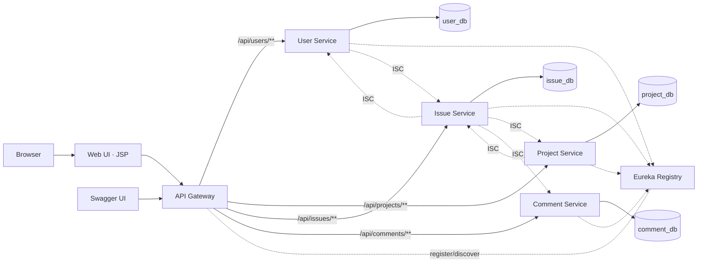

# Software Requirements Specification
## Issue Tracking System (ITS) — Spring Boot, Microservices, MySQL

| Field | Value |
|---|---|
| Document | Software Requirements Specification |
| Product | Issue Tracking System (ITS) |
| Sources | Case-study specification (v. 05.2026) and its reference workbook |
| Status | Revision 3 — assumptions reviewed; reference workbook incorporated |
| Companion | [DESIGN.md](./DESIGN.md) |

---

## 1. Introduction

### 1.1 Purpose
This document specifies the functional and non-functional requirements for an Issue Tracking System (ITS) built as a set of Spring Boot microservices backed by MySQL, with a JSP web front end. It is derived from the source case study and its reference workbook, and resolves the ambiguities found in them; every such resolution is recorded in [§12 Assumptions](#12-assumptions-and-open-questions) with an `A-nn` identifier and is traceable from the requirement that depends on it.

**All assumptions are now confirmed or resolved; none remain open.** Two were **reversed by the workbook** — the role encoding ([A-04](#a-04)) and the meaning of the `profile` column ([A-16](#a-16)) — and are called out because both had already propagated into the design.

### 1.2 Scope
The deliverable is a **RESTful backend plus a complete web UI**. It allows users to register and authenticate, Project Owners to create and manage projects and issues, and Assignees to view and progress the issues assigned to them. Services are independently deployable, register with a service registry, and are reached through a single API Gateway.

**In scope:** User, Project, Issue and Comment services; service discovery; API gateway; inter-service communication; API documentation; persistence in MySQL; a JSP-based web application covering sign-up, login and both role dashboards ([A-09](#a-09)).

**Out of scope:** Email/push notification delivery; binary file upload; reporting and analytics; multi-tenancy.

### 1.3 Definitions and Acronyms

| Term | Meaning |
|---|---|
| ITS | Issue Tracking System — the product specified here |
| Project Owner | Role that creates projects, creates issues and assigns them to users |
| Assignee | Role that views issues assigned to them and updates their status |
| ISC | Inter-Service Communication — a call from one microservice to another, marked in the source document |
| Gateway | Spring Cloud Gateway; the single entry point for all API traffic |
| Web tier | The JSP web application (`web-ui`); the system's only human-facing component |
| Workbook | The reference workbook supplied with the case study — schema and sample data |
| FR / NFR | Functional / Non-Functional Requirement |

### 1.4 References
1. Case study specification PDF (9 pages), reviewed during analysis; not redistributed with this repository.
2. Reference workbook containing the Issue, User and Project tables with sample rows. **Reviewed in full**; it is a single sheet covering the database only, with no sample endpoint outcomes ([A-19](#a-19)).

---

## 2. Overall Description

### 2.1 Product Perspective
Four bounded services sit behind a gateway, each owning its data exclusively; no service reads another service's tables. Anything one service needs from another is fetched over HTTP. The web tier is a client of the gateway like any other — it holds no business logic and no database.

### 2.2 User Roles

| Role | Stored as | Capabilities |
|---|---|---|
| **Project Owner** | `role = 0` | Everything an Assignee can do, plus: create/update/delete projects, create issues, assign issues, update any field of an issue in a project they own |
| **Assignee** | `role = 1` | View issues assigned to them, view the projects those issues belong to, update the status of their own issues, comment on issues |

The encoding is **`0` = Project Owner, `1` = Assignee**, established from the workbook's sample data and the reverse of what this document assumed in Revisions 1–2. See [A-04](#a-04).

### 2.3 Operating Environment
Java 17, Spring Boot 3.x, Spring Cloud 2023.x, MySQL 8.x. Each backend service runs as a standalone JAR; the web tier is packaged as a WAR ([A-09](#a-09)). Local development uses one MySQL server with four logical schemas ([A-02](#a-02)). The UI targets current Chrome, Firefox and Edge.

### 2.4 Design and Implementation Constraints
- **C-01** Every service is a separate Spring Boot application with its own build unit.
- **C-02** Each service persists to its own database schema. Cross-service foreign keys are prohibited.
- **C-03** Inter-service calls use RestTemplate or OpenFeign only — no shared database, no message broker.
- **C-04** All controller methods in the API services return `ResponseEntity`.
- **C-05** Every service exposes Swagger/OpenAPI documentation.
- **C-06** The project is version-controlled in Git and pushed to GitHub.
- **C-07** The web tier renders with JSP and JSTL, and reaches the backend only through the gateway — it never talks to a service directly and never opens a database connection.
- **C-08** Table and column names follow the workbook, not the PDF's ER diagram, where the two differ ([A-15](#a-15)).

---

## 3. Functional Requirements — User Management

### 3.1 Sign Up

**FR-USR-01** The system shall create a new user from name, email, password, profile description and role.
- **Inputs:** `name`, `email`, `password`, `profile` (optional — a short free-text description of the person, e.g. *"Front-end developer"*; see [A-16](#a-16)), `role`
- **Outputs:** `201 Created` with the created user (password never returned) and the message *"Your account is created successfully"*.
- **Process:** validate input, reject a duplicate email, hash the password, persist the user.

**FR-USR-02** The system shall reject sign-up with `409 Conflict` when the email is already registered.

**FR-USR-03** The system shall store passwords only as a one-way hash; a stored password shall never be returned by any endpoint. The workbook's plaintext sample passwords are illustrative and do not relax this ([A-05](#a-05)).

**FR-USR-04** The system shall validate that `email` is well-formed, `name` is 2–255 characters, `password` is at least 8 characters, `profile` is at most 255 characters, and `role` is one of the two defined values. Violations return `400 Bad Request` with a field-level error list.

### 3.2 Login

**FR-USR-05** The system shall authenticate a user from **email and password only**. ([A-03](#a-03))
- **Outputs:** `200 OK` with a signed JWT, the user id, and the role — the role lets the caller route to the correct dashboard.
- **Failure:** `401 Unauthorized` with a non-specific message that does not reveal whether the email exists.

**FR-USR-06** On successful login the user shall be directed to the dashboard corresponding to their role.

### 3.3 User Retrieval

**FR-USR-07** The system shall return a list of all users.

**FR-USR-08** The system shall return a single user by `user_id`, or `404 Not Found`.

**FR-USR-09** *(ISC)* The system shall return the issues assigned to a user identified by `user_id`, by delegating to the Issue Service.

**FR-USR-10** *(ISC)* The system shall return the issues assigned to a user identified by `username`, by resolving the username to a user id and then delegating to the Issue Service. `username` is the local part of the user's email address — the workbook has no username column, and its `sam.lee`-style values match that form ([A-18](#a-18)).

**FR-USR-11** When a delegated ISC call fails or times out, the endpoint shall return `503 Service Unavailable` with a descriptive message rather than an empty success response. ([A-08](#a-08))

---

## 4. Functional Requirements — Projects

**FR-PRJ-01** The system shall create a project from project name, project owner id, start date and end date, returning `201 Created` and the new project id.

**FR-PRJ-02** The system shall validate on creation that the referenced owner exists (verified against the User Service) and holds the Project Owner role (`role = 0`); otherwise `400 Bad Request`.

**FR-PRJ-03** The system shall validate that `end_date` is not earlier than `start_date`.

**FR-PRJ-04** The system shall return all projects.

**FR-PRJ-05** The system shall return a single project by `project_id`, or `404 Not Found`.

**FR-PRJ-06** The system shall return all projects owned by a given owner id.

**FR-PRJ-07** The system shall update an existing project by `project_id`.

**FR-PRJ-08** The system shall delete a project by `project_id`, returning `204 No Content`.

**FR-PRJ-09** Project deletion shall **cascade**: deleting a project deletes every issue belonging to it, and deleting those issues deletes their comments. The presence of open issues shall never block the delete. ([A-07](#a-07))

**FR-PRJ-10** The cascade shall be driven by the Project Service calling the Issue Service, which in turn calls the Comment Service. Each step is a bulk delete keyed on the parent id.

**FR-PRJ-11** If a cascade step fails, the operation shall return `503 Service Unavailable` and the project row shall **not** be deleted — the project is removed only after its issues are confirmed gone, so a failure leaves the data reachable rather than orphaned.

**FR-PRJ-12** The UI shall require an explicit confirmation naming the project and stating how many issues will be destroyed before submitting a delete.

**FR-PRJ-13** *(ISC)* The system shall return the issues belonging to a project identified by `project_id`, by delegating to the Issue Service.

**FR-PRJ-14** *(ISC)* The system shall return the issues belonging to a project identified by `project_name`, by resolving the name to a project id and then delegating to the Issue Service.

---

## 5. Functional Requirements — Issues

**FR-ISS-01** The system shall create an issue from summary, project id, description, priority, assignee id, status, type, story points, sprint, tags and created-by.
- **Outputs:** `201 Created` and the new issue id.

**FR-ISS-02** The system shall verify at creation that the referenced project exists (Project Service) and that the referenced assignee and creator exist (User Service); otherwise `400 Bad Request`.

**FR-ISS-03** The system shall set `created_on` server-side at creation and refresh `last_updated_on` on every modification. Client-supplied values for these fields shall be ignored.

**FR-ISS-04** The system shall return all issues.

**FR-ISS-05** The system shall return a single issue by id, or `404 Not Found`.

**FR-ISS-06** The system shall update an issue by id, accepting a partial set of fields — typically `status` and `assignee_id`.

**FR-ISS-07** An Assignee shall be permitted to modify only the `status` of an issue assigned to them; any other field they submit is rejected with `403 Forbidden`.

**FR-ISS-08** The system shall delete an issue by id, returning `204 No Content`, and shall delete that issue's comments as part of the same operation. ([A-06](#a-06), [A-07](#a-07))

**FR-ISS-09** The system shall delete all issues for a given project id in one call, used by the project cascade (FR-PRJ-10).

**FR-ISS-10** *(ISC)* The system shall return all issues for a given project id.

**FR-ISS-11** *(ISC)* The system shall return all issues created by a given owner id, matched on `created_by`.

**FR-ISS-12** *(ISC)* The system shall return all issues assigned to a given assignee id.

**FR-ISS-13** The enumerated fields shall take these values ([A-11](#a-11)):

| Field | Values | Attested in workbook |
|---|---|---|
| `status` | `TO_DO`, `IN_PROGRESS`, `IN_REVIEW`, `DONE` | `TO_DO` |
| `priority` | `LOW`, `MEDIUM`, `HIGH`, `CRITICAL` | `HIGH` |
| `type` | `BUG`, `TASK`, `STORY`, `EPIC` | `BUG` |

Values are `SCREAMING_SNAKE_CASE`, matching the workbook's `TO_DO`. Only the attested values are certain; the rest complete each set conventionally and are cheap to change because enums persist as strings, never ordinals.

**FR-ISS-14** The system shall reject a status transition out of `DONE` with `409 Conflict`; a completed issue must be reopened to `TO_DO` explicitly.

---

## 6. Functional Requirements — Comments

The workbook has no comment table, consistent with the Comment Service being an extension of the source specification rather than a restatement of it ([A-01](#a-01)).

**FR-CMT-01** The system shall create a comment on an issue from issue id, author id and body text.

**FR-CMT-02** The system shall return all comments for a given issue, newest first.

**FR-CMT-03** The system shall allow a comment's author to update or delete their own comment; any other user receives `403 Forbidden`.

**FR-CMT-04** *(ISC)* The Issue Service shall obtain an issue's comment count from the Comment Service so that an issue detail response can carry it.

**FR-CMT-05** The system shall delete all comments for a given issue id in one call, used by the issue delete and the project cascade (FR-ISS-08, FR-PRJ-10).

---

## 7. Functional Requirements — Web User Interface

The web tier is a server-rendered JSP application ([A-09](#a-09)) and is the only human-facing component. It calls the gateway for everything and holds no business rules of its own; validation there is for user experience, never for enforcement.

### 7.1 Access Control

**FR-UI-01** The application shall expose exactly three unauthenticated pages: sign-up, login, and the error pages. Every other page shall redirect to login when there is no active session.

**FR-UI-02** After login the application shall route Project Owners to `/owner/dashboard` and Assignees to `/assignee/dashboard` (FR-USR-06).

**FR-UI-03** A user who requests a page belonging to the other role shall receive a 403 page, not a redirect loop.

**FR-UI-04** The application shall provide logout, which invalidates the session and discards the token.

**FR-UI-05** When the backend answers `401` — typically an expired token — the application shall clear the session and return the user to login with an explanatory message, rather than showing a raw error.

### 7.2 Common Screens

**FR-UI-06 Sign Up.** A form for name, email, password, profile description and role, with client-side validation mirroring FR-USR-04. `profile` renders as a short free-text field, not a file picker or URL box ([A-16](#a-16)). On success it shows *"Your account is created successfully"* with a hyperlink to login, as the source document specifies. A duplicate email (409) is reported against the email field.

**FR-UI-07 Login.** A form for email and password only ([A-03](#a-03)), with a link to sign-up. A failed login shows one generic message.

### 7.3 Project Owner Screens

**FR-UI-08 Owner Dashboard.** Shows the owner's projects with a per-project issue count, and a breakdown of their issues by status and by priority. Every figure is derived from the API — the UI computes no totals the backend cannot also produce.

**FR-UI-09 Project List.** Table of the owner's projects (name, start date, end date, issue count) with create, edit and delete actions.

**FR-UI-10 Project Create / Edit.** A form for name, start date and end date; owner is taken from the session, never chosen. Enforces FR-PRJ-03 in the browser and reports the server's rejection if it slips through.

**FR-UI-11 Project Delete.** The confirmation required by FR-PRJ-12, stating the project name and the number of issues that will be destroyed, before it will submit.

**FR-UI-12 Project Detail.** Project fields plus its issue list, filterable by status, priority, type and assignee, and sortable by last-updated.

**FR-UI-13 Issue Create.** A form for summary, description, project, assignee, status, priority, type, story points, sprint and tags. Project and assignee lists are populated from the API; the assignee list is restricted to users holding the Assignee role (`role = 1`). Tags are entered comma-separated, matching the workbook's `profile,cache,update` form.

**FR-UI-14 Issue Edit.** Any field editable, plus reassignment.

### 7.4 Assignee Screens

**FR-UI-15 Assignee Dashboard.** The issues assigned to the logged-in user, grouped by status, with the count of those in the current sprint.

**FR-UI-16 Assignee Issue List.** All issues assigned to the user, filterable by status, priority and project.

**FR-UI-17 Status Update.** From the issue detail page an Assignee may change only the status (FR-ISS-07); every other field renders read-only. The control offers only transitions legal under FR-ISS-14.

### 7.5 Shared Screens

**FR-UI-18 Issue Detail.** Full issue fields with project name and assignee name resolved to human-readable values, plus the comment thread. Reachable by both roles; the available actions differ by role.

**FR-UI-19 Comments.** The thread shows author and timestamp newest-first and offers an add-comment form. Edit and delete controls appear only on the viewer's own comments (FR-CMT-03).

**FR-UI-20 Error Pages.** Dedicated 403, 404, 500 and 503 pages. A 503 explains that a service is temporarily unreachable and offers a retry — this is what an ISC failure (FR-USR-11) looks like to a human.

**FR-UI-21 Consistency.** Every page shares one layout: header with product name, logged-in user and logout, role-appropriate navigation, and a flash-message region for success and failure notices.

---

## 8. Functional Requirements — Platform

**FR-SYS-01** All four services shall register with the Eureka registry at startup and shall be visible on the Eureka dashboard.

**FR-SYS-02** All API traffic shall enter through the API Gateway; individual service ports shall not be part of the published contract.

**FR-SYS-03** The Gateway shall resolve service instances through the registry and load-balance across them client-side.

**FR-SYS-04** Every service shall publish OpenAPI documentation and a Swagger UI page.

**FR-SYS-05** Every service shall handle exceptions through a global `@RestControllerAdvice` and return a uniform error body: `timestamp`, `status`, `error`, `message`, `path`, and `fieldErrors` where applicable.

**FR-SYS-06** All endpoints except `POST /api/users` and `POST /api/users/login` shall require a valid JWT. ([A-05](#a-05))

**FR-SYS-07** Every service shall expose a health endpoint for readiness checking.

---

## 9. External Interface Requirements — API Specification

Paths are as published by the Gateway. Endpoints marked **ISC** are served by fanning out to another service. Rows marked **[A]** are additions not present in the source document; each cites its assumption.

### 9.1 User Service

| Method | Endpoint | Description | Success |
|---|---|---|---|
| GET | `/api/users` | Retrieve a list of all users | 200 |
| POST | `/api/users` | Create a new user | 201 |
| POST | `/api/users/login` | Authenticate a user and log them in | 200 |
| GET | `/api/users/{userId}` | Retrieve details of a specific user by user ID | 200 |
| GET | `/api/users/{userId}/issues` | **ISC** — issues assigned to a user by user ID | 200 |
| GET | `/api/users/username/{username}/issues` | **ISC** — issues assigned to a user by username ([A-18](#a-18)) | 200 |
| PUT | `/api/users/{userId}` | **[A]** Update a user's profile ([A-06](#a-06)) | 200 |
| DELETE | `/api/users/{userId}` | **[A]** Delete a user ([A-06](#a-06)) | 204 |

### 9.2 Project Service

| Method | Endpoint | Description | Success |
|---|---|---|---|
| GET | `/api/projects` | Retrieve a list of all projects | 200 |
| POST | `/api/projects` | Create a new project | 201 |
| GET | `/api/projects/{projectId}` | Retrieve a specific project by project ID | 200 |
| PUT | `/api/projects/{projectId}` | Update a specific project by project ID | 200 |
| DELETE | `/api/projects/{projectId}` | Delete a project and cascade to its issues and their comments | 204 |
| GET | `/api/projects/owner/{ownerId}` | Projects owned by a specific user | 200 |
| GET | `/api/projects/{projectId}/issues` | **ISC** — issues within a project by project ID | 200 |
| GET | `/api/projects/projectName/{projectName}/issues` | **ISC** — issues within a project by project name | 200 |

### 9.3 Issue Service

| Method | Endpoint | Description | Success |
|---|---|---|---|
| GET | `/api/issues` | Retrieve a list of all issues | 200 |
| POST | `/api/issues` | Create a new issue | 201 |
| GET | `/api/issues/{id}` | Retrieve a specific issue by issue ID | 200 |
| PUT | `/api/issues/{id}` | Update a specific issue by issue ID | 200 |
| GET | `/api/issues/project/{projectId}` | **ISC** — issues within a specific project | 200 |
| GET | `/api/issues/owner/{ownerId}` | **ISC** — issues created by a specific user | 200 |
| GET | `/api/issues/assignee/{assigneeId}` | **ISC** — issues assigned to a specific user | 200 |
| DELETE | `/api/issues/{id}` | **[A]** Delete an issue and its comments ([A-06](#a-06)) | 204 |
| DELETE | `/api/issues/project/{projectId}` | **[A]** **ISC** — bulk delete for the project cascade ([A-07](#a-07)) | 204 |

### 9.4 Comment Service **[A]** — [A-01](#a-01)

| Method | Endpoint | Description | Success |
|---|---|---|---|
| GET | `/api/comments/issue/{issueId}` | Comments on an issue, newest first | 200 |
| GET | `/api/comments/issue/{issueId}/count` | **ISC** — comment count for an issue | 200 |
| POST | `/api/comments` | Create a comment on an issue | 201 |
| PUT | `/api/comments/{id}` | Update own comment | 200 |
| DELETE | `/api/comments/{id}` | Delete own comment | 204 |
| DELETE | `/api/comments/issue/{issueId}` | **ISC** — bulk delete for the issue cascade ([A-07](#a-07)) | 204 |

### 9.5 Status Code Contract

| Code | Used when |
|---|---|
| 200 OK | Successful GET, PUT, or login |
| 201 Created | Resource created; `Location` header set |
| 204 No Content | Successful DELETE |
| 400 Bad Request | Validation failure, or a referenced entity does not exist |
| 401 Unauthorized | Missing, expired or invalid JWT; failed login |
| 403 Forbidden | Authenticated but not permitted for this role or resource |
| 404 Not Found | The addressed resource does not exist |
| 409 Conflict | Duplicate email, or a state rule violation |
| 503 Service Unavailable | A downstream ISC dependency is unreachable, including a failed cascade step |

---

## 10. Data Requirements

Column names are the workbook's ([A-15](#a-15)); where the PDF's ER diagram used a different name it is given as an alias, since the PDF is what a reviewer will have read.

### 10.1 `user_db.user`

| Column | Type | Notes |
|---|---|---|
| `user_id` | INT PK AUTO_INCREMENT | seed starts at 101 to match the workbook |
| `name` | VARCHAR(255) NOT NULL | e.g. *Emily Sinha* |
| `email` | VARCHAR(255) NOT NULL UNIQUE | index required by FR-USR-02; local part serves as the username ([A-18](#a-18)) |
| `password` | VARCHAR(255) NOT NULL | BCrypt hash — the workbook's plaintext values are illustrative only |
| `profile` | VARCHAR(255) NULL | **free-text description of the person**, not an image ([A-16](#a-16)) |
| `role` | TINYINT NOT NULL | `0` = Project Owner, `1` = Assignee ([A-04](#a-04)) |

### 10.2 `project_db.project`

| Column | Type | Notes |
|---|---|---|
| `project_id` | INT PK AUTO_INCREMENT | *alias in PDF:* `id`; seed starts at 1011 |
| `project_name` | VARCHAR(255) NOT NULL UNIQUE | uniqueness required by FR-PRJ-14 |
| `project_owner_id` | INT NOT NULL | *alias in PDF:* `project_owner`; logical reference to `user.user_id`, **not** a FK |
| `start_date` | DATE NOT NULL | |
| `end_date` | DATE NULL | |

### 10.3 `issue_db.issue`

| Column | Type | Notes |
|---|---|---|
| `issue_id` | INT PK AUTO_INCREMENT | *alias in PDF:* `id` |
| `summary` | VARCHAR(255) NOT NULL | |
| `description` | VARCHAR(255) | widen to TEXT if the sample descriptions prove longer than the photo showed |
| `project_id` | INT NOT NULL | *alias in PDF:* `project`; logical reference; indexed |
| `assignee_id` | INT NULL | *alias in PDF:* `assignee`; logical reference; indexed |
| `created_by` | INT NOT NULL | logical reference to `user.user_id`; indexed. The workbook's sample shows a *username* string here — see [A-17](#a-17) |
| `status` | ENUM | see FR-ISS-13 |
| `priority` | ENUM | see FR-ISS-13 |
| `type` | ENUM | see FR-ISS-13 |
| `story_points` | INT NULL | *alias in PDF:* `story_point` |
| `sprint` | VARCHAR(255) NULL | e.g. *Sprint 42* |
| `tags` | VARCHAR(255) NULL | comma-separated, e.g. *profile,cache,update* |
| `created_on` | DATETIME NOT NULL | ([A-12](#a-12)) |
| `last_updated_on` | DATETIME NOT NULL | *alias in PDF:* `last_updated` |

### 10.4 `comment_db.comment` **[A]**

| Column | Type | Notes |
|---|---|---|
| `comment_id` | INT PK AUTO_INCREMENT | |
| `issue_id` | INT NOT NULL | logical reference to `issue.issue_id`; indexed |
| `author_id` | INT NOT NULL | logical reference to `user.user_id` |
| `body` | TEXT NOT NULL | |
| `created_on` | DATETIME NOT NULL | |

### 10.5 Seed Data

The workbook's rows are the seed dataset, loaded per schema at development start-up. They are also the fixtures the Swagger examples and the manual acceptance pass are written against.

**Users** — note that both Project Owners carry `role = 0` and both engineers carry `role = 1`, which is the evidence behind [A-04](#a-04):

| user_id | name | profile | role |
|---|---|---|---|
| 101 | Emily Sinha | Project owner wit… | 0 — Project Owner |
| 102 | Michael Patel | Software enginee… | 1 — Assignee |
| 103 | Priya Jackson | Seasoned project… | 0 — Project Owner |
| 104 | Carlos Singh | Front-end develop… | 1 — Assignee |

**Projects** — every `project_owner_id` resolves to a `role = 0` user, satisfying FR-PRJ-02:

| project_id | project_name | project_owner_id | start_date | end_date |
|---|---|---|---|---|
| 1011 | Profile Man… | 101 | 2025-09-18 | 2025-12-18 |
| 1012 | Notification… | 103 | 2025-10-01 | 2026-01-15 |
| 1013 | User Analyti… | 101 | 2025-09-25 | 2025-12-10 |

**Issues** — every `assignee_id` resolves to a `role = 1` user:

| issue_id | summary | project_id | assignee_id | status | priority | type | story_points | sprint | tags |
|---|---|---|---|---|---|---|---|---|---|
| 1 | Profile cache not updating after changes | 1011 | 104 | TO_DO | HIGH | BUG | 2 | Sprint 42 | profile,cache,update |
| 2 | Notifications API failure | 1012 | 102 | TO_DO | HIGH | BUG | 2 | Sprint 42 | notifications,api,alerts |

Both sample issues carry `created_by = sam.lee`, a user absent from the User table — see [A-17](#a-17). Project 1013 has no issues, which makes it a useful fixture for the empty-state screens (FR-UI-12) and the cascade delete (FR-PRJ-09).

---

## 11. Non-Functional Requirements

**NFR-01 Performance.** The application shall have low latency and high throughput. Target: 95th-percentile response under 300 ms for single-entity reads and under 800 ms for ISC fan-out reads, at 50 concurrent users on a developer machine. A UI page shall issue no more than three backend calls before first render.

**NFR-02 Security.** The application and its data shall be secured by authentication. Passwords are stored hashed; tokens are signed and expiring; the JWT is never exposed to the browser ([A-14](#a-14)); no endpoint outside sign-up and login is anonymous. All JSP output is HTML-escaped.

**NFR-03 Scalability.** Backend services shall be horizontally scalable — stateless, no in-memory session, load-balanced through the registry. Session state exists only in the web tier.

**NFR-04 Maintainability.** Layered structure (controller / service / repository), dependency injection via constructor, meaningful comments, consistent naming.

**NFR-05 Extensibility.** The design shall permit later addition of real-time status updates, targeted notifications and richer in-issue commenting without restructuring existing services.

**NFR-06 Observability.** Structured logs carrying a correlation id propagated across ISC calls; health endpoints on every service.

**NFR-07 Documentation.** Swagger UI on every service; a README covering local start-up order.

**NFR-08 Robustness.** No unhandled exception may escape to the client; every API failure path returns the uniform error body of FR-SYS-05, and every UI failure path renders a styled error page (FR-UI-20).

**NFR-09 Usability.** One consistent layout across all pages; every destructive action confirmed; every form error shown against the field that caused it; readable at 1280 px and above.

---

## 12. Assumptions and Open Questions

Each entry states what the sources left unresolved, the decision taken, and its review status.

### A-01 — The Comment Service is built (4 services, not 3) · **Confirmed**
*Source conflict:* "Microservices Breakdown" lists Comment Service, but the architecture diagram shows three services, the API specification defines no comment endpoints, neither the ER diagram nor the workbook has a comment table, and the Table of Contents has no comment section. Milestone 5 nevertheless says *"refer section 7.1 to 7.4"* — and only three endpoint sections exist.
*Decision:* build it, with the contract in §9.4. The "Create Issue" input list includes `comments` while the `issue` table has no such column — consistent with comments living in their own service.

### A-02 — Database-per-service, on a shared MySQL instance · **Confirmed**
*Source conflict:* the architecture diagram shows three distinct databases; both the ER diagram and the workbook lay the tables out together in one view.
*Decision:* one schema per service (`user_db`, `project_db`, `issue_db`, `comment_db`) on a single local MySQL instance. Cross-service columns are plain integers validated over HTTP, never database foreign keys.

### A-03 — Login takes email and password only · **Confirmed**
*Source conflict:* the login section lists Name, Email, Password, Profile Image and Role — the sign-up field list, duplicated.
*Decision:* login is email + password. Role is *returned* by login, not supplied.

### A-04 — `role` is `0` = Project Owner, `1` = Assignee · **REVERSED by the workbook**
Revisions 1–2 guessed `0` = Assignee, `1` = Project Owner. The workbook's sample data settles it the other way: `emily.sinha` (*"Project owner wit…"*) and `priya.jackson` (*"Seasoned project…"*) both carry `role = 0`, while `michael.patel` (*"Software enginee…"*) and `carlos.singh` (*"Front-end develop…"*) carry `role = 1`. Corroborated twice over — every `project_owner_id` in the Project table points at a `role = 0` user, and every `assignee_id` in the Issue table points at a `role = 1` user.
*Impact:* any authorisation check written against the old encoding would have inverted the entire permission model while still passing a naive smoke test. The API therefore exposes the string form (`PROJECT_OWNER`, `ASSIGNEE`) and confines the integer to the persistence boundary, so the mapping is stated in exactly one place.

### A-05 — Authentication is JWT, issued at login, verified at the Gateway · **Confirmed**
*Source gap:* the NFRs demand authentication, but the only auth artifact specified is a login endpoint.
*Decision:* login returns a signed JWT carrying user id and role; the Gateway rejects requests without a valid token; downstream services trust the propagated identity headers. Passwords are BCrypt-hashed — the workbook's plaintext sample passwords are sample-sheet convenience, not a specification.

### A-06 — Missing CRUD verbs are added · **Confirmed**
*Source conflict:* the Objective requires "adding, retrieving, updating, and **deleting** issue records", but the Issue endpoint table has no DELETE, and the User table has no PUT or DELETE.
*Decision:* add `DELETE /api/issues/{id}`, `PUT /api/users/{userId}`, `DELETE /api/users/{userId}`.

### A-07 — Project deletion cascades · **Confirmed, reversed from Revision 1**
Revision 1 refused to delete a project holding issues. **Reversed on review:** a project is deleted regardless of its issues, and the delete cascades — project → its issues → their comments. Because the three live in separate databases, this is an orchestrated cascade over HTTP, not a database `ON DELETE CASCADE`, and it must run child-first so that a mid-way failure leaves data reachable rather than orphaned (FR-PRJ-11). The irreversibility is handled in the UI by the confirmation of FR-PRJ-12.

### A-08 — ISC failures surface as 503, not as empty results · **Confirmed**
Returning an empty list on a downstream outage would be indistinguishable from a genuine empty result, so failures are explicit.

### A-09 — A complete JSP web UI is delivered · **Confirmed, reversed from Revision 1**
Revision 1 read the Objective and the eight API-verified milestones as backend-only. **Reversed on review:** a finished UI is required, built with **JSP and JSTL**, served by a separate `web-ui` Spring Boot module packaged as a WAR. Requirements are in §7. Note that JSP cannot be served from an executable JAR — a hard-coded Tomcat file pattern breaks it — so WAR packaging is a constraint, not a preference.

### A-10 — Reference workbook · **RESOLVED**
Received. It supplies the three tables with sample rows and settles [A-11](#a-11), [A-15](#a-15), [A-16](#a-16) and, decisively, [A-04](#a-04). Its contents are folded into §10.

### A-11 — Enumerated values · **RESOLVED for the attested values**
The ER diagram elided every `ENUM(...)` value. The workbook attests `status = TO_DO`, `priority = HIGH`, `type = BUG`. `TO_DO` in particular rules out the `OPEN`/`CLOSED` vocabulary Revisions 1–2 proposed, and fixes the casing convention as `SCREAMING_SNAKE_CASE`. The remaining members of each set (FR-ISS-13) complete them along conventional lines and are not attested; persisting enums as strings keeps the cost of changing them to a one-column data migration.

### A-12 — `created_on` / `last_updated_on` are DATETIME, not DATE · **Confirmed**
Both sources type these as dates, and the workbook's samples show date-only values — but two issues created on the same day cannot then be ordered. Widened to `DATETIME`.

### A-13 — "Issue Detail" and "Retrieve Issues" are one requirement · **Confirmed**
The two sections in the source are word-for-word identical. Treated as a single set of retrieval requirements, not two features.

### A-14 — The JWT lives in the web tier's server-side session · **Confirmed**
JSP renders server-side, so "hold the token in memory" resolves to the web tier's `HttpSession`: the browser receives only a `JSESSIONID` cookie and never sees the JWT. An outbound interceptor attaches it as `Authorization: Bearer` on every gateway call, and a second interceptor enforces role-based routing (FR-UI-02, FR-UI-03). This keeps the token out of reach of any script on the page, at the cost of session state in the web tier — acceptable because that tier is the only stateful component and is not what scales (NFR-03).

### A-15 — Column names follow the workbook · **New in Revision 3**
The two sources disagree: the PDF's ER diagram has `id`, `project`, `assignee`, `last_updated`, `story_point`, `project_owner`; the workbook has `issue_id`, `project_id`, `assignee_id`, `last_updated_on`, `story_points`, `project_owner_id`.
*Decision:* follow the workbook. It is the more explicit naming, it is the shape the sample data actually ships in, and it disambiguates `project` (an id, despite reading like an object). §10 records the PDF names as aliases so a reviewer working from the PDF can still follow the schema.

### A-16 — `profile` is a text description, not an image · **REVERSED by the workbook**
The PDF prose repeatedly says "profile image", and Revisions 1–2 modelled the column as a URL or path. The workbook's sample values are *"Project owner wit…"*, *"Software enginee…"*, *"Seasoned project…"*, *"Front-end develop…"* — plainly a short biography.
*Decision:* `profile` is free text describing the person. The sign-up screen renders a text field rather than a file picker or URL box (FR-UI-06), and image upload leaves the scope entirely. If a profile *image* is later wanted, it is a new column, not a reinterpretation of this one.

### A-17 — `created_by` is an INT user id · **New in Revision 3, decided against the sample**
The workbook's two sample issues both carry `created_by = sam.lee` — a string, where the ER diagram types the column `INT`. The sample is internally inconsistent: no `sam.lee` exists in its own User table, and the sibling column `assignee_id` is a numeric id in the very same rows.
*Decision:* store `created_by` as an `INT` user id, consistent with `assignee_id` and with the endpoint contract `GET /api/issues/owner/{ownerId}`, which is specified as taking an ID. The seed loader maps `sam.lee` onto a real user id. **Worth raising in the technical interview** — if the intent was genuinely to key issue authorship by username, the change is one column type plus the resolution step in FR-ISS-11.

### A-18 — `username` is the local part of the email · **New in Revision 3**
`GET /api/users/username/{username}/issues` requires a username, but neither source defines a username column. The workbook's `sam.lee` matches the local part of an address of the form `sam.lee@…`, and its real users are `emily.sinha@…`, `michael.patel…`, `priya.jackson…`, `carlos.singh…` — the same shape.
*Decision:* `username` is derived as the substring of `email` before the `@`, resolved by a lookup on `email LIKE 'username@%'` against the unique email index. No new column, no new uniqueness rule.

### A-19 — Sample endpoint outcomes do not exist · **RESOLVED**
The PDF describes the attachment as *"Endpoints and DB"* and says it carries sample endpoint outcomes alongside the sample data. Confirmed on review that the workbook has **one sheet**, holding the three database tables only — there are no sample request/response payloads anywhere in the sources.
*Consequence:* the JSON shapes in [DESIGN.md](./DESIGN.md) §5.1 are this project's own contract, derived from the prose field lists and the workbook columns, and nothing external will contradict them. They are settled by decision rather than by reference, which makes §5.1 worth agreeing early — it is the only remaining place where the API's surface was invented rather than sourced.

---

## 13. Acceptance Criteria and Milestone Traceability

| Milestone | Source requirement | Satisfied by |
|---|---|---|
| 1 | User Microservice with §7.1 endpoints, tested in Swagger UI | FR-USR-01..08, §9.1 |
| 2 | Project Microservice with §7.2 endpoints, tested in Swagger UI | FR-PRJ-01..08, §9.2 |
| 3 | Issue Microservice with §7.3 endpoints, tested in Swagger UI | FR-ISS-01..08, §9.3 |
| 4 | Eureka Server implemented; all services on the dashboard | FR-SYS-01 |
| 5 | All inter-service communication endpoints (§7.1–7.4) | FR-USR-09, -10; FR-PRJ-13, -14; FR-ISS-10, -11, -12; FR-CMT-04 |
| 6 | `ResponseEntity` throughout; Swagger for API documentation | C-04, FR-SYS-04, FR-SYS-05 |
| 7 | API Gateway with client-side load balancing | FR-SYS-02, FR-SYS-03 |
| 8 | Build pushed to a GitHub repository | C-06 |
| — | *Web UI — no source milestone; added per [A-09](#a-09)* | FR-UI-01..21 |
| Interview | Discussion of Assumptions, Functionalities and Validations | §12 is the assumptions register for this discussion |

### Definition of Done
- All endpoints in §9 return the status codes in §9.5 and are exercisable through the Gateway.
- All four services appear as `UP` on the Eureka dashboard.
- Swagger UI loads for each service, and the aggregated UI behind the Gateway lists all four.
- Every endpoint in §9 is callable from that UI: the Authorize button carries the JWT across services, so no endpoint needs a second tool to exercise it.
- The workbook's seed data (§10.5) loads cleanly and every ISC endpoint returns the expected rows against it.
- Every screen in §7 is reachable, both dashboards render live data, and no page shows a stack trace.
- Deleting a project removes its issues and their comments, verified across all three databases.
